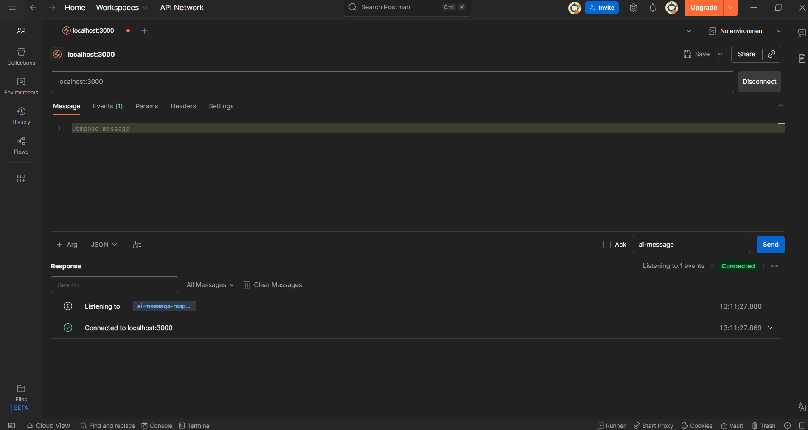
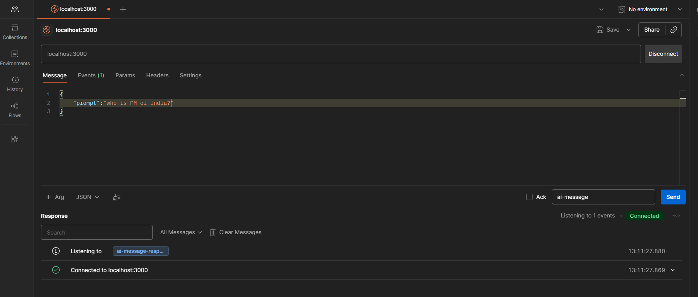
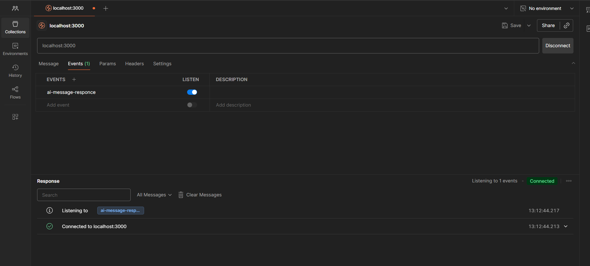
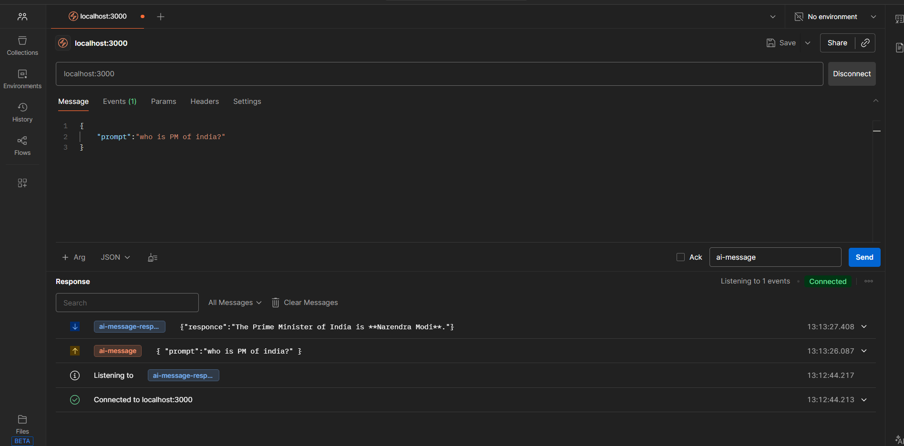

# Chat-bot_Backend
# ⚡ Real-Time AI Chat Server (Express + Socket.IO + Google Gemini)

A production-ready **real-time AI chat backend** built with:
- Node.js + Express
- Socket.IO (NOT plain WebSockets)
- Google Gemini AI
- Short-term conversational memory

Designed for **chat apps, customer support bots, collaborative tools, and real-time AI assistants**.

---

## 🏆 Highlights
✔️ High-performance real-time Socket.IO server  
✔️ Google Gemini powered AI responses  
✔️ Short-term chat memory per session  
✔️ Postman Socket.IO testing support  
✔️ Clean architecture & scalable structure  
✔️ Ready for deployment (Render / Railway / VPS / Docker)

---

## 📸 Screenshots

### ✅ Socket.IO Connection (Postman)


### 📨 Sending AI Message


### 📨 (Postman) Event 


### 📥 Receiving AI Response


> 📌 Create a folder `/assets` in your project root and place screenshots:
> - `assets/postman-connect.png`
> - `assets/postman-send.png`
> - `assets/postman-event.png`
> - `assets/postman-response.png`

---

## 📂 Project Structure
├── Chat-bot_Backend
├── assets
├── src
│ ├── app.js
│ └── services
│ └── ai.service.js
├── server.js
├── package.json
└── .env


---

## 🔧 Installation & Setup

### 1️⃣ Clone Repo
```bash
git clone https://github.com/NimeshGhag/Chat-bot_Backend.git
cd Chat-bot_Backend

2️⃣ Install Dependencies
npm install

▶️ Start Server
npm start


Logs:

Server is running on port 5000

⚡ Socket.IO API
📩 Client → Server

Event: ai-message

Payload:

{
  "prompt": "Hello AI"
}

📤 Server → Client

Event: ai-message-responce

Response:

{
  "responce": "AI reply text..."
}

🧪 TEST USING POSTMAN (Socket.IO Mode)

🚨 This project uses Socket.IO, NOT WebSocket**.
Do NOT use ws:// connections. Use Socket.IO Request.

✅ Step 1 — Open Socket.IO Request

1️⃣ Open Postman
2️⃣ Click New → Socket.IO
(or click + and select Socket.IO tab)

✅ Step 2 — Connect

Enter:
localhost:5000


Click Connect

Expected log in your server:

A user is connected

✅ Step 3 — Send Event

Event Name:

ai-message


Message Body:

{
  "prompt": "Hello AI, how are you?"
}


Click Send

✅ Step 4 — Receive Response

Postman will show:

Event: ai-message-responce


Data:

{
  "responce": "AI reply here..."
}


🎉 You're done!

✅ Step 3 — Send Event

Event Name:

ai-message


Message Body:

{
  "prompt": "Hello AI, how are you?"
}


Click Send

✅ Step 4 — Receive Response

Postman will show:

Event: ai-message-responce


Data:

{
  "responce": "AI reply here..."
}


🎉 You're done!
🧠 Chat Memory

This project stores session history in memory:

const chatHistory = [];


✔️ Maintains short-term context
❌ Resets when server restarts

🤝 Contributing
PRs welcome! Fork → Improve → PR 🎯